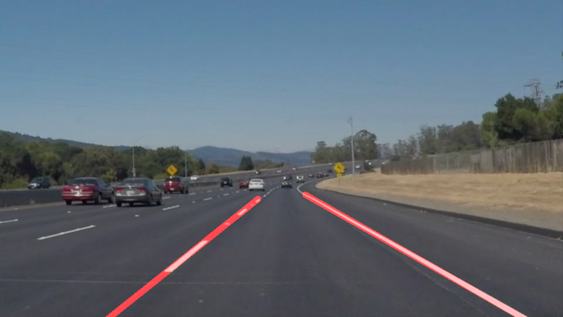

# **Finding Lane Lines on the Road**
&nbsp;
*Udacity Self-Driving Car Engineer Nanodegree Project 1*

_Final output still from the image processing pipeline_

### **Project Overview**

This project contains the results from completing Project 1 of the Udacity Self-Driving Car Engineer Nanodegree. The goal of the project is to create an image processing pipeline using basic computer vision techniques, including Canny edge detection and Hough transforms, to correctly identify lane lines on the road. The pipeline should be robust enough to work on a series of images (video) with varying conditions, including cars on the road, color variations from shadows.

#### Files in the repository
* Code for the pipeline is contained in the [Project 1 IPython notebook](./P1.ipynb)
* A [writeup](./WRITEUP.md) detailing the results of the project and describing the procedure for deriving a single straight line corresponding to a series of line segments found by the Hough transform.
* The processed videos (the same pipeline was used to process each video):
  * A video with a [solid white lane on the right](./white.mp4)
  * A video with a [solid yellow lane on the left](./yellow.mp4)
  * A video with [more challenging features](./extra.mp4), such as shadows occluding the lane lines and cars in the adjacent lanes

#### Running the code
This project was developed using Python 3.5. The IPython notebook can be run using [Jupyter Notebooks](http://jupyter.org/). The project depends on the [NumPY](http://www.numpy.org/), [OpenCV](http://opencv.org/), [Matplotlib](http://matplotlib.org/) & [MoviePy](http://zulko.github.io/moviepy/) libraries.
