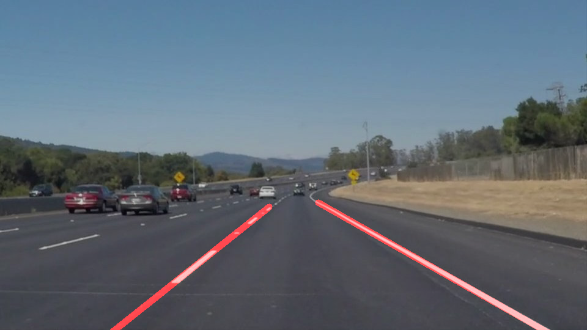

# **Finding Lane Lines on the Road**

## Reflection

#### 1. Pipeline Description

##### Initial Attempt

My initial image processing pipeline consisted of 6 steps:
  1. Convert image to grayscale
  1. Apply Gaussian blur
  1. Apply Canny edge detection
  1. Apply polygon mask to eliminate non relevant noise
  1. Apply probabilistic Hough transform to detect line segments
  1. Separate the line segments into Left and Right buckets, and fit a single line to each bucket of points *([discussed further below](#drawing-lines))*

This pipeline was very effective at detecting the lanes for the `solidWhiteRight.mp4` and `solidYellowLeft.mp4` input videos, rendering solid lines that tracked the lanes in the videos with minimal jitter. However, when I attempted to apply this processing to the `challenge.mp4` video, the lane lines danced chaotically across the images.

#### Analysis

By outputting the Canny edge step of the process to video and overlaying the lines, it became clear that the Hough transform was detecting lines on the cars in adjacent lanes as well as a considerable number of edges found in shadows on the road and other objects passing through the scene.

My first attempt at resolving this was to twiddle the parameters of my pipeline, tweaking the threshold values of the Canny edge detector and fine tuning the shape of my polygon mask. This worked fairly well at eliminating the noise from nearby cars, but the drawn lines still jumped wildly when shadows occluded the lanes. It also struck me as a very brittle and overfitted solution, which would fail as soon as the pipeline was applied to slightly varying conditions.

What I needed was a way to separate signal from noise. The only things in the scene I cared about were the lane lines. If I could amplify these, while eliminating everything else, the pipeline should operate smoothly.

#### Solution

The answer was to define a range of color values for yellow and white and use these to mask out everything that did not fall into these ranges, using the `cv2.inRange()`.

Converting the image to the HSV color space made it easy to define a range of hues, saturations and darkness values that I wanted to keep. Using an eyedropper tool, I sampled various yellows and whites from the lanes in all three videos to come up with realistic color ranges into which the lanes were likely to fall, including those occluded by shadows. Everything that did not fall within these ranges was masked out, leaving a mostly black image, greatly simplified, with very clear lane lines.

This became step 0 of my pipeline. Running the rest of the pipeline on these filtered images produced much smoother results.

_Masking out all non-yellow and non-white pixels, converting to grayscale and applying gaussian blur._

_Canny edge detection and applying polygon mask_

_Finding line segments with Hough transform, fitting a continuous line to each side, and applying to original image_

## **Procedure for Extracting 2 Continuous Lines from a Set of Line Segments**

In order to derive 2 solid lane lines from the cloud of line segments found by the Hough transform, the following steps are taken:

  - Identify each line segment as belonging to either the Left or Right side of the lane, based on the `x` value of its end points.
  - After all segments are classified by side, do the following for each side:

    - Calculate the slope of each segment. If the slope is within certain tolerances (e.g. is neither nearly vertical nor horizontal), add the `x1` and `x2` values of the segment to a list `X` and add the `y1` and `y2` values to another list `Y`. Otherwise, discard it.
    - Feed the lists `X` and `Y` into the `numpy.polyfit` function with a degree of `1`. This will fit a straight line to the points by minimizing the squared error with respect to the points in `X` and `Y`.
    - Pass the result of the polyfit function to `numpy.poly1d`, which returns a function of the line `f(x) = mx + b`. That is, when given a value for `x`, it will output the corresponding `y` value to plot a point on the line that best fits the line segments. From there, it is possible to plot a line from, say, the midpoint of the image to the left or right edge that closely matches the slope and y-intercept of the lane line.

-----

### 2. Potential Pipeline Shortcomings

- While the pipeline is fairly robust to noise and color variation, it does tend to jitter if the best fit to the line segments found in a given frame is a line whose slope deviates significantly from the frame preceding it. Worse yet, if the Hough transform and filtering produces no line segments at all, the line will simply disappear.

- Sharp curves and hills would change the angles of the lines and probably break the lane detector.

- If the car were to change lanes, the results would be chaotic during the lane change.

-----

### 3. Possible Pipeline Improvements

- One possible improvement would be to create a buffer of slope and y-intercept values for the last N frames and to overlay a line whose parameters are a rolling mean of these values. This should smooth out the jitter and give the pipeline a "memory" so that if no line segments are detected, it could continue to overlay the last calculated line until another is found.

- Rather than fitting a line, fitting a curve with a higher degree polynomial might provide a more accurate set of lane lines for sharp curves. Having more polygon mask shapes (e.g. for sharp right or left turns) might also be necessary if the curves are very sharp.

- Defining a procedure to detect a lane change and switch the lane lines to next lane would be needed for a smooth transition.
